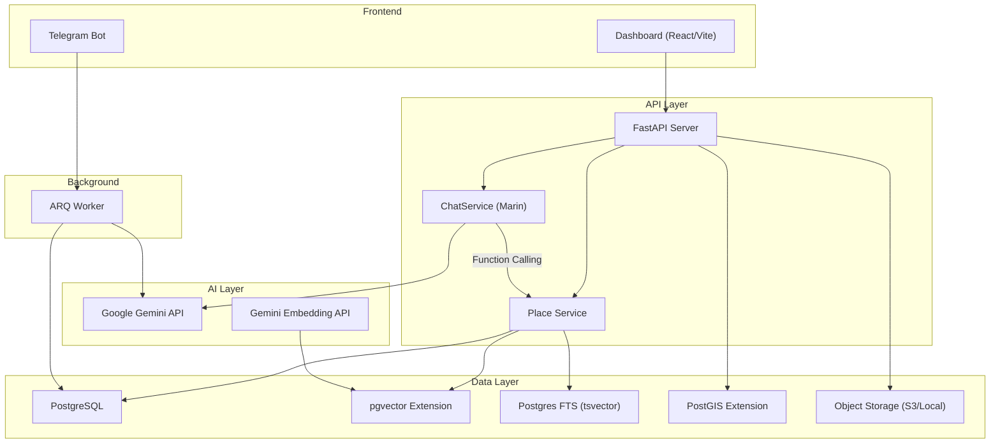

# System Architecture

> **Status**: Production  
> **Last Updated**: 2026-02-19

---

## High-Level Diagram



---

## Core Patterns

### 1. Agentic Chat (One-Pass Tool Use)

Marin uses **Gemini Function Calling** in a One-Shot pattern — no infinite ReAct loop.

```
User → Gemini (Turn 1: reason + tool_call) → Execute Tool → Gemini (Turn 2: FunctionResponse → final answer)
```

Maximum 2 LLM calls per user message. System instruction passed via `GenerateContentConfig` to avoid prompt duplication.

### 2. Hybrid Search (RRF)

Search combines two retrieval legs:

- **Semantic**: pgvector cosine distance on `Place.embedding` (3072d)
- **Keyword**: Postgres FTS `ts_rank` on `Place.search_text` (tsvector + GIN index)

Merged via **Reciprocal Rank Fusion** (k=60):

```
score(place) = 1/(k + semantic_rank) + 1/(k + keyword_rank)
```

### 3. Condensed Memory

Chat sessions use a two-tier memory strategy:

- **Short-term**: Last 5 raw messages (verbatim)
- **Long-term**: Single `ChatSession.summary` (LLM-condensed older messages)
- **User Profile**: `UserMemory` rows (preferences, dislikes)

Condensation triggers when session messages exceed 10.

### 4. Place Data Quality Pipeline

Every Place save runs through `quality.on_place_save()`:

1. `sync_location()` — lat/lon ↔ PostGIS geometry
2. `regenerate_embedding()` — text → 3072d vector via Gemini Embedding
3. `sync_search_text()` — metadata → tsvector for FTS

---

## Key Components

| Component     | File                                 | Responsibility                              |
| ------------- | ------------------------------------ | ------------------------------------------- |
| Chat Service  | `src/modules/places/chat_service.py` | Agentic chat orchestration                  |
| Place Service | `src/modules/places/service.py`      | Place CRUD + Hybrid Search                  |
| Quality Utils | `src/modules/places/quality.py`      | Embedding, location, search text sync       |
| LLM Service   | `src/core/llm.py`                    | Gemini API wrapper (text, tools, JSON, OCR) |
| AI Embeddings | `src/core/ai.py`                     | Gemini Embedding API wrapper                |
| SQL Models    | `src/core/database/sql_models.py`    | SQLModel schema definitions                 |
| Worker Tasks  | `src/modules/worker/tasks.py`        | Background processing (Telegram → DB)       |

---

## Extensions & Dependencies

| Technology     | Purpose                                    |
| -------------- | ------------------------------------------ |
| PostgreSQL 16+ | Primary database                           |
| pgvector       | Vector similarity search (cosine distance) |
| PostGIS        | Geospatial queries (distance, containment) |
| Postgres FTS   | Full-text search (tsvector + GIN)          |
| Google Gemini  | LLM (chat, analysis, OCR) + Embedding API  |
| ARQ            | Background task queue (Redis-backed)       |
| FastAPI        | HTTP API framework                         |
| SQLModel       | ORM (Pydantic + SQLAlchemy)                |
