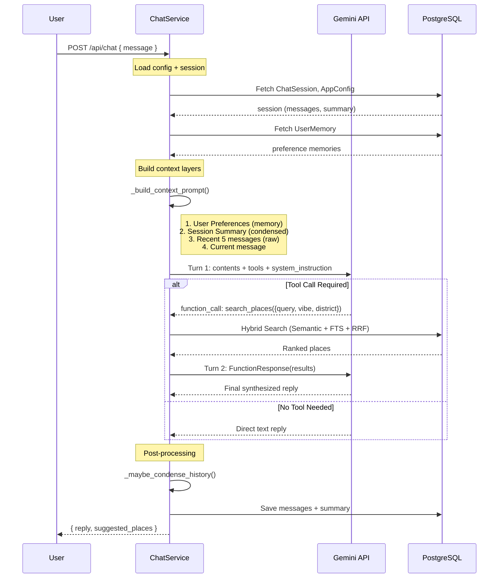
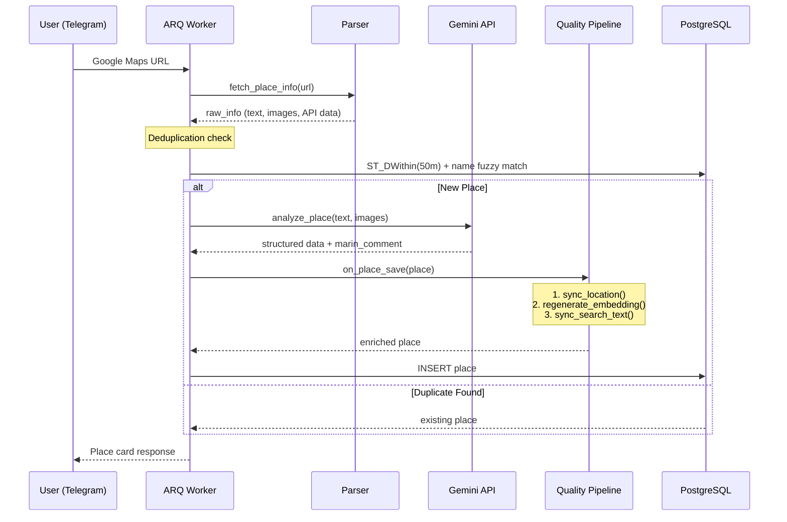
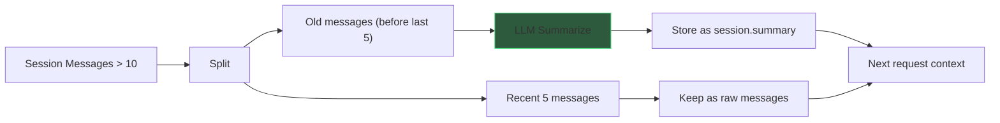

# System Flows

> **Last Updated**: 2026-02-19

---

## 1. Marin Chat Flow (One-Pass Tool Use)

---

## 2. Hybrid Search Flow

```mermaid
flowchart TB
    Q["User Query"] --> EMB["Generate Embedding (Gemini)"]
    Q --> TSQ["plainto_tsquery('simple', query)"]

    EMB --> SEM["Semantic Search<br/>pgvector cosine distance<br/>Top 20 candidates"]
    TSQ --> KW["Keyword Search<br/>ts_rank(search_text, tsquery)<br/>Top 20 candidates"]

    SEM --> RRF["Reciprocal Rank Fusion<br/>score = 1/(60+rank_sem) + 1/(60+rank_kw)"]
    KW --> RRF

    RRF --> TOP["Top 5 Results"]

    style RRF fill:#2d5a3d,stroke:#4ade80
    style SEM fill:#1e3a5f,stroke:#60a5fa
    style KW fill:#5a2d2d,stroke:#f87171
```

---

## 3. Place Ingestion Flow

---

## 4. Memory Condensation Flow

