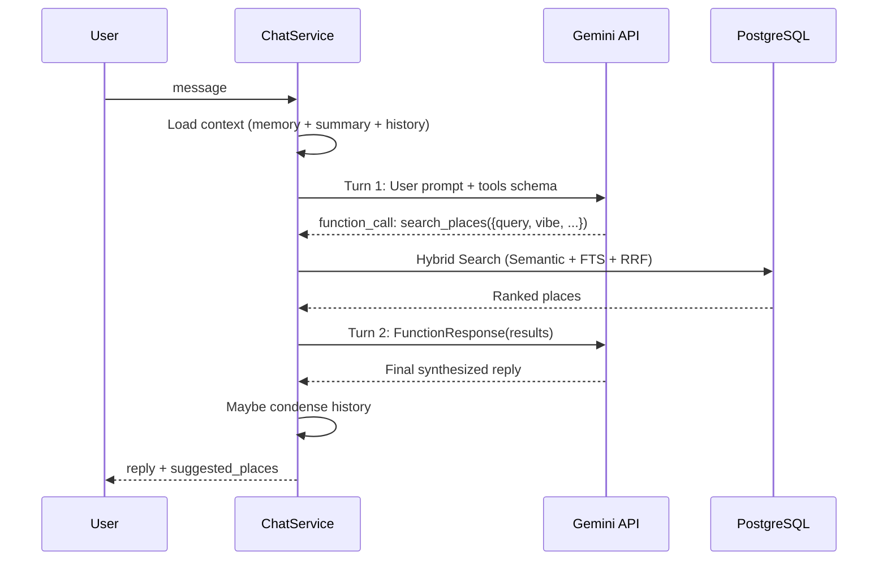

# Feature: AI Chat — Marin 🎀

> **PRD Reference**: FR-08 (Search), Section 4.1 (Chat)  
> **Status**: ✅ Working (v2 — One-Pass Tool Use)  
> **Source**: `src/modules/places/chat_service.py`, `src/core/llm.py`

---

## Overview

**Marin** is Spotary's AI conversational agent — a friendly, knowledgeable local guide for Ho Chi Minh City. Users chat naturally in Vietnamese, and Marin responds with place recommendations using **Gemini Function Calling** + **Hybrid Search** (RAG).

---

## Architecture (v2 — One-Pass Tool Use)



**Key difference from v1**: Uses Gemini's native `FunctionResponse` protocol instead of string concatenation. System instruction passed via config (not duplicated in prompt). Maximum 2 LLM calls per message.

---

## API Endpoint

### `POST /api/chat`

**Request**:

```json
{
  "session_id": "abc-123",
  "message": "Có quán nào view đẹp không?"
}
```

**Response**:

```json
{
  "session_id": "abc-123",
  "reply": "Marin biết mấy quán view chill lắm nè! 🌃\n\n1. **Chill Skybar** — Rooftop view...",
  "suggested_places": [
    { "id": "uuid", "name": "Chill Skybar", "address": "...", "vibes": [...] }
  ]
}
```

---

## Feature Details

### 1. Guardrail System

| Check        | Threshold   | Response                                       |
| :----------- | :---------- | :--------------------------------------------- |
| Too long     | > 500 chars | "Tin nhắn dài quá, tóm tắt giúp mình nhé!"     |
| Too short    | < 2 chars   | "..."                                          |
| Contains URL | Any URL     | "Mình không xem được link, gửi text thôi nhé!" |

### 2. Tool Definition

Marin has a single tool: `search_places` with parameters:

| Parameter    | Type   | Required | Description                                       |
| ------------ | ------ | -------- | ------------------------------------------------- |
| `query`      | STRING | ✅       | Search keywords (translated to English if needed) |
| `vibe`       | STRING | ❌       | Target vibe: cozy, quiet, lively, romantic        |
| `district`   | STRING | ❌       | District filter: District 1, Thảo Điền            |
| `categories` | STRING | ❌       | Category filter: cafe, restaurant, bar            |

Gemini decides autonomously whether to call the tool based on user intent.

### 3. Context Layers (Condensed Memory)

Context is assembled from 4 layers (long-term → short-term):

1. **User Preferences** — `UserMemory` rows (preferences, dislikes)
2. **Session Summary** — LLM-condensed older conversation (`ChatSession.summary`)
3. **Recent Chat** — Last 5 raw messages
4. **Current Message** — User's new input

**Condensation trigger**: When session exceeds 10 messages, older messages are summarized into `session.summary` and trimmed.

### 4. Hybrid Search (RRF)

When the tool is called, search uses:

- **Semantic leg**: pgvector cosine distance
- **Keyword leg**: Postgres FTS `ts_rank`
- **Fusion**: Reciprocal Rank Fusion (k=60)

See [04-semantic-search.md](./04-semantic-search.md) for details.

### 5. Session Management

- Sessions stored in `chat_sessions` table (PostgreSQL).
- `session_id` — string identifier (cookie/public ID).
- `messages` — JSONB array of `{ role, content, timestamp }`.
- `summary` — condensed history (TEXT, auto-generated by LLM).
- `seen_place_ids` — tracks which places have been shown.

---

## Dynamic Configuration

Marin's behavior is controlled via `AppConfig` (key: `"global"`, field: `MARIN`):

```json
{
  "AVATAR_NAME": "Marin 🎀",
  "SYSTEM_INSTRUCTION": "You are Marin, an AI local guide for HCMC..."
}
```

Admins can update this config via `PUT /api/config` to tune Marin's personality and prompt without code changes.

---

## LLM Service (`src/core/llm.py`)

### Key Methods

| Method                                                     | Purpose                            |
| :--------------------------------------------------------- | :--------------------------------- |
| `generate_with_tools(contents, system_instruction, tools)` | Agentic chat with function calling |
| `generate_text(prompt)`                                    | Simple text generation             |
| `analyze_place(text, images)`                              | Place analysis (structured JSON)   |
| `generate_json(prompt, schema)`                            | Schema-enforced JSON               |
| `extract_menu(images)`                                     | Menu OCR via Gemini Vision         |
| `analyze_aesthetic(images)`                                | Aesthetic scoring (1-10)           |
