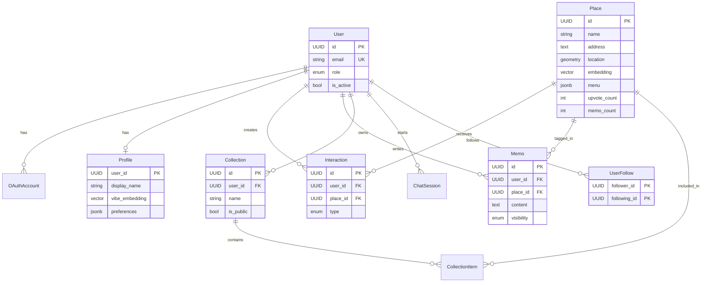

# LocBook Product Requirements Document (PRD)

| Field | Value |
| :--- | :--- |
| **Project Name** | LocBook — The Social Vibe Archive |
| **Version** | 2.1 |
| **Status** | In Migration / Development |
| **Last Updated** | 2026-02-11 |

---

## 1. Executive Summary

**LocBook** is an AI-powered personal location assistant and social discovery platform for Ho Chi Minh City. Unlike Google Maps (logistics) or TripAdvisor (reviews), LocBook focuses on **"Vibes"** and **"Memories."**

An AI Agent ("**Marin**") via Telegram instantly captures places from screenshots and links. A web dashboard lets users explore, filter, and discover places using **Semantic Search** (pgvector). In version 2.0, LocBook evolves into a **Social Vibe Archive** — users create personal journals (**Memos**), curate **Collections**, and discover places through trusted social connections.

---

## 2. Problem Statement

| Problem | Description |
| :--- | :--- |
| **Fragmentation** | Users save places across Notes, Instagram Saves, Google Maps Lists — retrieval is painful. |
| **Lack of Context** | A saved link has no "why" — no vibe, no must-try dish, no mood. |
| **Toxic Reviews** | Public review platforms suffer from spam and negativity, eroding trust. |
| **Generic Search** | "Quiet cafe for coding" returns SEO-optimized, generic results. |

---

## 3. User Personas

### 3.1. The Capturer (Telegram-First)
- Scrolls TikTok/Instagram, screenshots a cool spot → sends to Bot.
- Need: **Zero-effort capture**. "Just save this for me."

### 3.2. The Explorer (Web/App User)
- Looking for a place to go **now**, or planning a date.
- Need: **Semantic search + Smart Filters**.

### 3.3. The Curator (Social User)
- Documents experiences and shares with friends.
- Need: **Collections, Memos, and Social Proof**.

---

## 4. Current System Audit

> What already exists in the codebase (as of 2026-02-11).

### 4.1. Architecture

| Component | Technology | Location |
| :--- | :--- | :--- |
| Backend | FastAPI (Python, Async) | `apps/api/` |
| User Dashboard | React + Vite | `apps/dashboard/` |
| Admin Dashboard | React + Vite | `apps/admin/` |
| Database | PostgreSQL + pgvector + PostGIS | `docker-compose.yml` |
| ORM | SQLModel | `src/database/sql_models.py` |
| AI/LLM | Google Gemini (+ Local LLM fallback) | `src/core/llm.py` |
| Bot | python-telegram-bot | `src/bot/handlers.py` |
| Monorepo | Nx | `nx.json` |

### 4.2. Existing Features (Working)

#### Bot Module (`src/bot/`)
| Feature | Handler | Status |
| :--- | :--- | :--- |
| Screenshot Analysis | `handle_photo` — Gemini Vision extracts Place data from images | ✅ Working |
| Google Maps Link Parsing | `handle_message` — Crawls metadata via Places API + AI summarization | ✅ Working |
| Geo-Search | `handle_location` — PostGIS query for nearby places | ✅ Working |
| Place Detail View | `handle_view_command` — `/view_{id}` shows full details | ✅ Working |
| Rate Limiting | `rate_limiter.py` — Per-user throttle | ✅ Working |

#### API Endpoints (`src/api.py`)
| Endpoint | Method | Auth | Description |
| :--- | :--- | :--- | :--- |
| `/api/places` | GET | Public | List places (paginated, search) |
| `/api/places/{id}` | GET | Public | Place detail |
| `/api/places/{id}` | PUT | Admin | Update place |
| `/api/places/{id}` | DELETE | Admin | Delete place |
| `/api/stats` | GET | Public | Count statistics |
| `/api/config` | GET/PUT | Public/Admin | Dynamic app config (JSONB) |
| `/api/chat` | POST | Public | Chat with Marin AI |
| `/api/upload-avatar` | POST | Admin | Upload Marin avatar |
| `/health` | GET | Public | Health check |
| `/api/version` | GET | Public | Version info |

#### Routers (`src/routers/`)
| Router | Prefix | Auth | Status |
| :--- | :--- | :--- | :--- |
| `auth.py` | `/auth/google` | Public | ✅ Google OAuth login |
| `users.py` | `/api/users/me` | JWT | ✅ Get/Update profile |
| `interactions.py` | `/api/interactions` | JWT | ✅ Create/Delete interaction (upvote/view) |
| `discovery.py` | `/api/discovery/places` | JWT | ✅ Vector similarity search |
| `onboarding.py` | `/api/onboarding/submit` | JWT | ✅ Vibe quiz → embedding |

#### Core Services (`src/core/`)
| Service | File | Description |
| :--- | :--- | :--- |
| AI Service | `llm.py` | Gemini + LocalLLM with image/text/place analysis |
| Link Parser | `parser.py` | Google Maps URL → Places API → AI analysis |
| Chat Service | `chat_service.py` | Marin AI conversationwith RAG |
| Text Embedding | `ai.py` | Gemini text embedding generation |
| Vector Store | `vector_store.py` | Embedding helper (pgvector) |
| Image Manager | `image_manager.py` | Local image storage |
| Security | `security.py` | JWT token creation/verification |

#### Database Models (`src/database/sql_models.py`)
| Model | Table | Status |
| :--- | :--- | :--- |
| `User` | `users` | ✅ Defined |
| `OAuthAccount` | `oauth_accounts` | ✅ Defined |
| `Profile` | `profiles` | ✅ Defined |
| `Place` | `places` | ✅ Defined, with pgvector + PostGIS |
| `Interaction` | `interactions` | ✅ Defined, with UniqueConstraint |
| `ChatSession` | `chat_sessions` | ✅ Defined |
| `AppConfig` | `app_config` | ✅ Defined |
| `Memo` | `memos` | 🆕 Schema only (no API yet) |
| `Collection` | `collections` | 🆕 Schema only (no API yet) |
| `CollectionItem` | `collection_items` | 🆕 Schema only (no API yet) |
| `UserFollow` | `user_follows` | 🆕 Schema only (no API yet) |

#### Frontend Dashboard (`apps/dashboard/`)
| Feature | Component | Status |
| :--- | :--- | :--- |
| Search & Filters | `App.jsx` — text search, vibe/category filters | ✅ Working |
| Place Cards | `PlaceCard` — thumbnail grid | ✅ Working |
| Place Modal | `App.openModal` — detail view with hero image | ✅ Working |
| Map View | `MapView.jsx` — Leaflet pins | ✅ Working |
| Category Row | `CategoryRow.jsx` — horizontal tag scroller | ✅ Working |
| Chat with Marin | `ChatView.jsx` — AI conversation | ✅ Working |
| Share | `ShareButton` — copy link | ✅ Working |

#### Admin Dashboard (`apps/admin/`)
- Place CRUD management
- Config editor
- Stats overview
- Avatar upload

### 4.3. Legacy / Technical Debt

| Item | Detail | Action Required |
| :--- | :--- | :--- |
| MongoDB references in `config.py` | `MONGO_URI`, `MONGO_DB_NAME` still defined | Remove |
| Beanie imports in `main.py` | Commented out but still present | Clean up |
| ChromaDB references in `config.py` | `CHROMA_SERVER_HOST/PORT` still defined | Remove |
| `src/database/models.py` | Old Beanie/Mongo model file | Delete |
| `PlaceRead` / `PlaceUpdate` | Removed from `sql_models.py` by user, still imported in `discovery.py` | Fix imports |
| `profile.metadata_` | Old `metadata` column renamed, referenced in `users.py` & `onboarding.py` | Migrate to `preferences` |

---

## 5. Functional Requirements (PRD 2.0)

### 5.1. Intelligence Acquisition (Bot Enhancement)

#### FR-01: Screenshot Analysis
- **Input**: Image to Telegram Bot.
- **Process**: Gemini Vision → structured Place data.
- **Output**: Place Card saved to DB. *Existing, maintain.*

#### FR-02: Google Maps Link Parsing
- **Input**: Google Maps URL.
- **Process**: Places API + scraping + LLM summarization.
- **Output**: Place with AI vibe tags. *Existing, enhance.*

#### FR-03: Geo-Search
- **Input**: Live location.
- **Process**: PostGIS `ST_DWithin` within 2km.
- **Output**: Top 5 places by distance + vibe. *Existing, maintain.*

#### FR-04: Menu Extraction (New)
- **Input**: Screenshot of menu, or Google Maps photos.
- **Process**: Gemini Vision OCR → structured `MenuItem` list.
- **Output**: Stored in `Place.menu` (JSONB).

### 5.2. Identity & Personalization

#### FR-05: Passwordless Authentication
- Google OAuth 2.0 only. JWT sessions. *Existing.*

#### FR-06: Onboarding Vibe Profile
- Select vibe tags → generate vector embedding → store in Profile. *Existing.*

#### FR-07: Profile Management (Enhance)
- Update: Display Name, Avatar, Bio, **Interesting Vibes** (preferences JSONB).
- *Existing partially, needs `preferences` column migration.*

### 5.3. Place Management & Discovery

#### FR-08: Semantic Search
- Hybrid: pgvector cosine similarity + keyword filter.
- *Existing for authenticated users, needs public access tier.*

#### FR-09: Menu Display
- Dedicated "Menu" tab in Place Detail.
- Show `is_signature` items first ("Must Try").
- Filter by price range.

#### FR-10: Smart Filters
- Category, Price Level ($-$$$), Vibe Tags, **Open Now** (compare `opening_hours`).

### 5.4. Ranking & Fairness

#### FR-11: Upvote System
- **1 User = 1 Vote per Place**. `UniqueConstraint(user_id, place_id, type)` enforced.
- Toggle behavior: upvote/remove upvote.
- `Place.upvote_count` denormalized for fast reads.

#### FR-12: Vibe Match Score
- Cosine distance between user `vibe_embedding` and `Place.embedding`.
- Used to re-rank results based on personal preference.

#### FR-13: Popularity Score
- Simple `upvote_count`. Higher = more popular.
- Sort option: "Most Popular" vs "Best Match for You."

#### FR-14: Rate Limiting
- API-level: max N requests/minute per IP (existing `rate_limiter.py`).

### 5.5. Social & Memory

#### FR-15: Memo System (Journal)
- A personal entry linked to a Place.
- Fields: Content, Images, Visit Date, Rating (hidden, 1-5 for AI).
- **Visibility**: `PUBLIC` / `FOLLOWERS` / `PRIVATE` (Enum).
- Privacy enforced at query level (WHERE clause, not RLS).

#### FR-16: Collections (Lists)
- User creates named lists (e.g., "Date Night Spots").
- Add/Remove Places to Collection.
- `is_public` flag → shareable URL or private.

#### FR-17: Social Graph
- Follow/Unfollow via `user_follows` link table.
- "Friends who've been here" shown on Place Detail (based on public Memos).

#### FR-18: Access Control for Unregistered Users
- **Can**: View public places list, view Place detail.
- **Cannot**: Upvote, Bookmark, Save, use "Ask Marin" chat,  create Memos/Collections.
- Prompt: "Sign in to unlock full features."

---

## 6. Non-Functional Requirements

### 6.1. Performance
| Metric | Target |
| :--- | :--- |
| Semantic Search Latency | < 200ms |
| Bot Acknowledgement | < 2s |
| AI Processing (Screenshot) | < 10s |

### 6.2. Security
- JWT with configurable expiry (default 7 days).
- Private Memos enforced at API query level.
- Admin operations require `x-admin-token` header.
- CORS configured per environment.

### 6.3. Infrastructure
| Component | Technology |
| :--- | :--- |
| Database | PostgreSQL 16 + pgvector + PostGIS |
| Cache (future) | Redis (for rate limiting, sessions) |
| Container | Docker + Docker Compose |
| CI/CD | Docker image builds → VPS deploy |

---

## 7. Data Architecture

---

## 8. Implementation Roadmap

### Phase 1: Database Cleanup & User System Foundation
*Goal: Stable, clean architecture. Zero MongoDB dependency.*

- **1.1. Legacy Cleanup**
    - [ ] Remove `MONGO_URI`, `MONGO_DB_NAME`, `CHROMA_*` from `config.py`
    - [ ] Delete `src/database/models.py` (old Beanie models)
    - [ ] Remove `beanie`, `motor` from `requirements.txt`
    - [ ] Clean commented-out imports in `main.py`
    - [ ] Remove `mongodb/`, `chromadb/` directories
    - [ ] Update `docker-compose.yml` to remove MongoDB service comments

- **1.2. Schema Finalization**
    - [ ] Verify all SQLModel relationships compile and create tables correctly
    - [ ] Fix `PlaceRead` / `PlaceUpdate` schemas (removed from models, still referenced)
    - [ ] Migrate `profile.metadata_` → `profile.preferences` in routers
    - [ ] Run `init_db` and verify all 10 tables exist in Postgres
    - [ ] Write data migration for existing places (lat/lon sync, menu default)

- **1.3. Authentication & IAM Polish**
    - [ ] Verify Google OAuth end-to-end flow
    - [ ] Implement token refresh / re-authentication logic
    - [ ] Profile API: add `preferences` (vibes) update endpoint
    - [ ] Onboarding: migrate from `metadata_` to `preferences` column
    - [ ] Role-based access: differentiate `user` vs `admin` in middleware

### Phase 2: Place Analysis Enhancement
*Goal: Richer place data through AI and Google Maps.*

- **2.1. Menu Intelligence**
    - [ ] Update bot `handle_photo` to detect menu screenshots (vs. place screenshots)
    - [ ] Implement Gemini Vision OCR prompt for menu extraction
    - [ ] Parse OCR result into `List[MenuItem]` schema
    - [ ] API endpoint: `PUT /api/places/{id}/menu` (Admin + Bot)
    - [ ] API endpoint: `GET /api/places/{id}/menu` (Public)

- **2.2. Google Maps Deep Integration**
    - [ ] Enhance `parser.py` to extract more metadata (user review summaries, popular times)
    - [ ] Auto-generate richer `vibe` and `mood` tags via LLM prompt
    - [ ] Extract and store menu data from Google Maps "Menu" photos
    - [ ] Duplicate detection before saving (check `google_maps_url` uniqueness)

- **2.3. Place Data Quality**
    - [ ] Implement `lat/lon` ↔ PostGIS `location` sync on save
    - [ ] Auto-compute `aesthetic_score` via AI image analysis
    - [ ] Implement embedding re-generation when Place data changes

### Phase 3: Ranking & Fairness System
*Goal: Trustworthy, spam-resistant ranking.*

- **3.1. Upvote System Enhancement**
    - [ ] Implement toggle logic in `interactions.py` (upvote on/off)
    - [ ] Update `Place.upvote_count` via DB trigger or API logic on upvote/remove
    - [ ] Enforce `UniqueConstraint` on `(user_id, place_id, type)` — already in schema

- **3.2. Ranking Algorithm**
    - [ ] Implement "Most Popular" sort (by `upvote_count DESC`)
    - [ ] Implement "Best Match" sort (by vector cosine distance to user vibe)
    - [ ] Implement "Trending" sort (upvotes in last 7 days)
    - [ ] Add sort parameter to `/api/places` endpoint

- **3.3. API Rate Limiting**
    - [ ] Enhance `rate_limiter.py` for per-endpoint limits
    - [ ] Add Redis-backed rate limiting (future, when scaling)

### Phase 4: UX/UI Enhancement
*Goal: Premium, polished user experience.*

- **4.1. Place Detail Revamp**
    - [ ] Redesign Place Detail: Hero Image, Info Section, Menu Tab, Vibe Tags
    - [ ] Show `upvote_count` and `memo_count` on Place cards
    - [ ] Menu tab: show items grouped by category, "Must Try" badge for `is_signature`

- **4.2. Discovery & Navigation**
    - [ ] Map View: Custom pins with category icons (Leaflet/Mapbox)
    - [ ] "Discovery Feed" — Pinterest-style masonry layout
    - [ ] Smart Filter UI: Price slider, "Open Now" toggle, Vibe tag chips

- **4.3. Access Control UI**
    - [ ] Limit features for unregistered users
    - [ ] Show login prompt when trying to upvote/save/chat
    - [ ] "Sign in with Google" button (prominent)

- **4.4. Interaction Polish**
    - [ ] Micro-animations for upvote (heart burst), bookmark (slide in)
    - [ ] Smooth transitions between List → Map → Detail views
    - [ ] Loading skeletons instead of spinners

### Phase 5: Social Features
*Goal: Community, memory, and sharing.*

- **5.1. Memo System**
    - [ ] API: `POST /api/memos` — create memo (text, images, visit_date, visibility)
    - [ ] API: `GET /api/places/{id}/memos` — get public memos for a place
    - [ ] API: `GET /api/users/me/memos` — get user's own memos (all visibility)
    - [ ] API: `DELETE /api/memos/{id}` — delete own memo
    - [ ] Image upload for memo photos
    - [ ] Update `Place.memo_count` on create/delete
    - [ ] Privacy: filter by visibility at query level

- **5.2. Collections**
    - [ ] API: `POST /api/collections` — create collection
    - [ ] API: `GET /api/collections` — list user's collections
    - [ ] API: `POST /api/collections/{id}/items` — add place to collection
    - [ ] API: `DELETE /api/collections/{id}/items/{place_id}` — remove place
    - [ ] API: `GET /api/collections/{id}` — public shareable view
    - [ ] Frontend: "Save to Collection" button on Place Detail

- **5.3. Social Graph**
    - [ ] API: `POST /api/users/{id}/follow` — follow user
    - [ ] API: `DELETE /api/users/{id}/follow` — unfollow user
    - [ ] API: `GET /api/users/{id}/followers` — list followers
    - [ ] API: `GET /api/users/{id}/following` — list following
    - [ ] "Friends who've been here" badge on Place Detail (based on public memos from followed users)
    - [ ] Activity Feed: "X upvoted Y" / "X wrote a memo for Z"

---

## 9. Environment Configuration

| Variable | Purpose | Required |
| :--- | :--- | :--- |
| `TELEGRAM_BOT_TOKEN` | Telegram bot auth | ✅ |
| `GEMINI_API_KEY` | Gemini LLM/Vision/Embedding | ✅ |
| `GOOGLE_PLACES_API_KEY` | Google Maps Places API | Optional |
| `POSTGRES_URL` | PostgreSQL connection string | ✅ |
| `SECRET_KEY` | JWT signing key | ✅ |
| `GOOGLE_CLIENT_ID` | OAuth client ID | For Auth |
| `GOOGLE_CLIENT_SECRET` | OAuth client secret | For Auth |
| `ADMIN_SECRET` | Admin API key header value | ✅ |
| `ENABLE_BOT` | Toggle Telegram bot | Default: `true` |

---

## 10. Success Metrics

| Metric | Target |
| :--- | :--- |
| Places in DB | > 200 curated spots |
| Search relevance | > 80% "useful" results (subjective) |
| Bot response time | < 10s for screenshot analysis |
| Active weekly users | Track via interactions |
| Upvotes per place (avg) | > 3 (indicates engagement) |