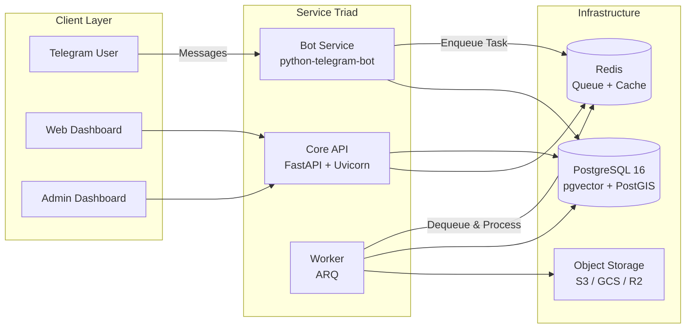
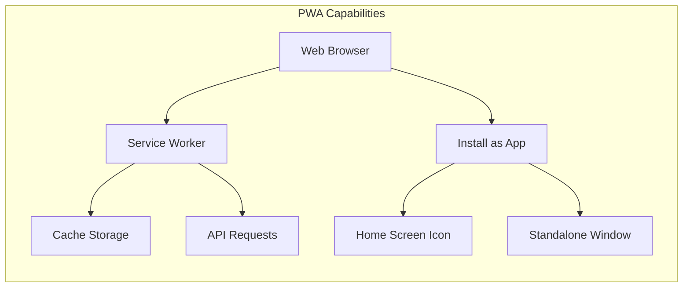
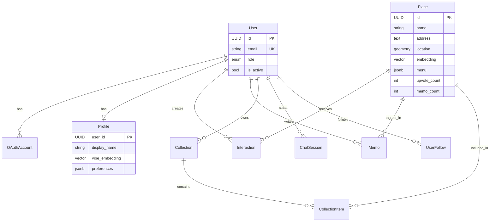

# LocBook Product Requirements Document (PRD)

| Field | Value |
| :--- | :--- |
| **Project Name** | LocBook — The Social Vibe Archive |
| **Version** | 1.2 |
| **Status** | In Development |
| **Last Updated** | 2026-02-12 |

---

## 1. Executive Summary

**LocBook** is an AI-powered personal location assistant and social discovery platform for Ho Chi Minh City. Unlike Google Maps (logistics) or TripAdvisor (reviews), LocBook focuses on **"Vibes"** and **"Memories."**

An AI Agent ("**Marin**") via Telegram captures places from Google Maps links. A web dashboard lets users explore, filter, and discover places using **Semantic Search** (pgvector). In version 2.0, LocBook evolves into a **Social Vibe Archive** — users create personal journals (**Memos**), curate **Collections**, and discover places through trusted social connections.

---

## 2. Problem Statement

| Problem | Description |
| :--- | :--- |
| **Fragmentation** | Users save places across Notes, Instagram Saves, Google Maps Lists — retrieval is painful. |
| **Lack of Context** | A saved link has no "why" — no vibe, no must-try dish, no mood. |
| **Toxic Reviews** | Public review platforms suffer from spam and negativity, eroding trust. |
| **Generic Search** | "Quiet cafe for coding" returns SEO-optimized, generic results. |

---

## 3. User Personas

### 3.1. The Capturer (Telegram-First)
- Scrolls TikTok/Instagram, finds a cool spot → sends Google Maps link to Bot.
- Need: **Zero-effort capture**. "Just save this for me."

### 3.2. The Explorer (Web/App User)
- Looking for a place to go **now**, or planning a date.
- Need: **Semantic search + Smart Filters**.

### 3.3. The Curator (Social User)
- Documents experiences and shares with friends.
- Need: **Collections, Memos, and Social Proof**.

---

## 4. System Architecture

> [!IMPORTANT]
> **v1.2 Architecture Change**: From a monolithic single-process to a **3-container Triad** sharing a database and Redis.

The system adopts a **Modular Monolith** pattern. Code lives in a single repository (Monorepo) but deploys as **3 independent containers** sharing a database and Redis.

### 4.1. Runtime Components (The Triad)

| Service | Technology | Responsibility | Scaling Strategy |
| :--- | :--- | :--- | :--- |
| **1. Core API** | FastAPI (Uvicorn) | Stateless HTTP handling, Auth, Search, Serve Web/Admin. | Scale horizontally based on Web traffic. |
| **2. Bot Service** | python-telegram-bot | **Polling only**. Receives Google Maps links → Pushes tasks to Redis. | Scale based on Telegram throughput. |
| **3. Worker** | **ARQ** + Redis | Background heavy lifting: AI Vision, Data Import, Analytics Roll-up. | Scale based on Queue depth. |



### 4.2. Infrastructure

| Component | Technology | Usage |
| :--- | :--- | :--- |
| **Database** | **PostgreSQL 16** | Main transactional DB (Users, Places). |
| **Extensions** | `pgvector`, `postgis` | Vector Search (Vibe) & Geo-Search. |
| **Message Broker** | **Redis** | Task Queue for Worker & Cache. |
| **Object Storage** | **S3 / GCS / Cloudflare R2** | Stateless image storage (via `StorageService`). |

### 4.3. Current Codebase

| Component | Technology | Location |
| :--- | :--- | :--- |
| Backend | FastAPI (Python, Async) | `apps/api/` |
| User Dashboard | React + Vite (PWA) | `apps/dashboard/` |
| Admin Dashboard | React + Vite | `apps/admin/` |
| Database | PostgreSQL + pgvector + PostGIS | `docker-compose.yml` |
| ORM | SQLModel | `src/database/sql_models.py` |
| AI/LLM | Google Gemini | `src/core/llm.py` |
| Bot | python-telegram-bot | `src/bot/handlers.py` |
| Monorepo | Nx | `nx.json` |

### 4.4. Target Directory Structure (Backend)

> [!NOTE]
> Current code lives flat in `src/`. Phase 2 will restructure into modules below.

```
apps/api/
├── data/                       # Local file storage (dev mode)
├── logs/                       # Log files
├── src/
│   ├── core/                   # Shared infrastructure (DB, Config, Redis, AI)
│   │   ├── config.py           # Settings & env vars
│   │   ├── database/           # PostgreSQL, SQLModel models
│   │   ├── redis.py            # Redis connection & helpers
│   │   ├── ai.py               # Gemini client & embedding
│   │   ├── llm.py              # LLM service (analyze, generate)
│   │   ├── prompts/            # Separated prompt files
│   │   ├── security.py         # JWT, auth helpers
│   │   └── utils.py            # Shared utilities (to_toon, etc.)
│   │
│   ├── modules/                # BUSINESS LOGIC (Feature modules)
│   │   ├── analytics/          # Event logging, roll-ups, gap analysis
│   │   │   ├── models.py       # AnalyticsEvent, UserMonthlyStat, SystemDailyStat
│   │   │   ├── service.py      # log_event(), get_stats()
│   │   │   └── router.py       # GET /api/admin/analytics
│   │   │
│   │   ├── auth/               # Authentication & user management
│   │   │   ├── models.py       # User, OAuthAccount, Profile
│   │   │   ├── service.py      # OAuth flow, JWT, profile
│   │   │   ├── router.py       # /auth/*, /api/users/*
│   │   │   └── dependencies.py # get_current_user, require_admin
│   │   │
│   │   ├── bot/                # Telegram bot handlers
│   │   │   ├── handlers.py     # /start, /help, link handler
│   │   │   ├── strings.py      # Bot-specific messages
│   │   │   └── rate_limiter.py # Per-user throttle
│   │   │
│   │   ├── notification/       # Notifications
│   │   │   ├── models.py       # Notification
│   │   │   ├── service.py      # create, mark_read
│   │   │   └── router.py       # GET/POST /api/notifications
│   │   │
│   │   ├── places/             # Place management (core feature)
│   │   │   ├── models.py       # Place, PlaceRead, PlaceUpdate, MenuItem
│   │   │   ├── service.py      # CRUD, search, parser, chat
│   │   │   ├── parser.py       # Google Maps link → Place data
│   │   │   └── router.py       # /api/places/*, /api/discovery/*
│   │   │
│   │   ├── social/             # Memos, Collections, Follows
│   │   │   ├── models.py       # Memo, Collection, CollectionItem, UserFollow
│   │   │   ├── service.py      # CRUD + privacy logic
│   │   │   └── router.py       # /api/memos/*, /api/collections/*
│   │   │
│   │   ├── storage/            # Media upload (S3/R2/Local)
│   │   │   ├── service.py      # StorageService ABC + implementations
│   │   │   └── router.py       # /api/upload (if needed)
│   │   │
│   │   └── worker/             # Background tasks
│   │       ├── tasks.py        # process_link, generate_embedding, rollup
│   │       └── settings.py     # ARQ WorkerSettings
│   │
│   └── services/               # ENTRYPOINTS (3 containers run from here)
│       ├── api.py              # FastAPI app (Uvicorn)
│       ├── bot.py              # Telegram Bot (Polling)
│       └── worker.py           # ARQ Worker
│
├── Dockerfile.api
├── Dockerfile.bot
├── Dockerfile.worker
└── requirements.txt
```

**Key principles:**
- **`core/`** = Infrastructure layer. No business logic. Shared by all modules.
- **`modules/`** = Business logic, split by feature. Each module owns its models, service, and router.
- **`services/`** = Entrypoints only. Wire modules together and start the process.

### 4.5. Frontend Architecture (PWA)

> [!IMPORTANT]
> The User Dashboard (`apps/dashboard/`) will be a **Progressive Web App (PWA)** — runs in browser AND can be installed as a native-like app on mobile.

| Aspect | Technology | Detail |
| :--- | :--- | :--- |
| **Framework** | React + Vite | Existing, fast HMR |
| **PWA Plugin** | `vite-plugin-pwa` | Auto-generates Service Worker + manifest |
| **Caching** | Workbox (via plugin) | Precache shell, runtime cache API responses |
| **Install** | Web App Manifest | `manifest.json` with icons, theme, display: standalone |
| **Offline** | Cache-first for static, Network-first for API | Graceful degradation |
| **Push (future)** | Web Push API | Via notification module (Phase 3+) |



---

## 5. Current Features (Working)

### 5.1. Bot Module (`src/bot/`)

| Feature | Handler | Status |
| :--- | :--- | :--- |
| Google Maps Link Parsing | `handle_message` — Fetch + AI analysis → save Place | ✅ Working |
| Rate Limiting | `rate_limiter.py` — Per-user throttle | ✅ Working |

> [!NOTE]
> Screenshot analysis, geo-search, and general chat were removed in v1.2 refactor. Bot is now admin-only link ingestion.

### 5.2. API Endpoints (`src/api.py`)

| Endpoint | Method | Auth | Description |
| :--- | :--- | :--- | :--- |
| `/api/places` | GET | Public | List places (paginated, search) |
| `/api/places/{id}` | GET | Public | Place detail |
| `/api/places/{id}` | PUT | Admin | Update place |
| `/api/places/{id}` | DELETE | Admin | Delete place |
| `/api/stats` | GET | Public | Count statistics |
| `/api/config` | GET/PUT | Public/Admin | Dynamic app config (JSONB) |
| `/api/chat` | POST | Public | Chat with Marin AI |
| `/api/upload-avatar` | POST | Admin | Upload Marin avatar |
| `/health` | GET | Public | Health check |

### 5.3. Routers (`src/routers/`)

| Router | Prefix | Auth | Status |
| :--- | :--- | :--- | :--- |
| `auth.py` | `/auth/google` | Public | ✅ Google OAuth login |
| `users.py` | `/api/users/me` | JWT | ✅ Get/Update profile |
| `interactions.py` | `/api/interactions` | JWT | ✅ Create/Delete interaction |
| `discovery.py` | `/api/discovery/places` | JWT | ✅ Vector similarity search |
| `onboarding.py` | `/api/onboarding/submit` | JWT | ✅ Vibe quiz → embedding |

### 5.4. Core Services (`src/core/`)

| Service | File | Description |
| :--- | :--- | :--- |
| AI Service | `llm.py` | Gemini: `analyze_place`, `generate_text`, `generate_json` |
| Link Parser | `parser.py` | Google Maps URL → Places API → TOON context |
| Chat Service | `chat_service.py` | Marin AI conversation with RAG |
| Text Embedding | `ai.py` | Gemini text embedding generation |
| Prompts | `prompts/` | Separated prompt files (place_analysis, schema, chat) |
| Security | `security.py` | JWT token creation/verification |

### 5.5. Database Models (`src/database/sql_models.py`)

| Model | Table | Status |
| :--- | :--- | :--- |
| `User` | `users` | ✅ Defined |
| `OAuthAccount` | `oauth_accounts` | ✅ Defined |
| `Profile` | `profiles` | ✅ Defined |
| `Place` | `places` | ✅ Defined, with pgvector + PostGIS |
| `Interaction` | `interactions` | ✅ Defined |
| `ChatSession` | `chat_sessions` | ✅ Defined |
| `AppConfig` | `app_config` | ✅ Defined |
| `Memo` | `memos` | 🆕 Schema only (no API yet) |
| `Collection` | `collections` | 🆕 Schema only (no API yet) |
| `CollectionItem` | `collection_items` | 🆕 Schema only (no API yet) |
| `UserFollow` | `user_follows` | 🆕 Schema only (no API yet) |

### 5.6. Frontends

**User Dashboard** (`apps/dashboard/`): Search, Place Cards, Map View, Chat with Marin.  
→ **PWA-ready** (installable on mobile, offline shell caching). React + Vite.

**Admin Dashboard** (`apps/admin/`): Place CRUD, Config editor, Stats overview.  
→ Desktop-only. React + Vite. No PWA needed.

---

## 6. New Modules & Functional Requirements (v1.2)

### 6.1. Internal Intelligence (Analytics Module)

*Goal: Understand "Search Intent" and "Content Gaps" without bloating the DB.*

#### FR-A1: Lean Logging (Raw Stream)
- **Mechanism**: Log events (`SEARCH`, `CLICK_MAP`, `VIEW_DETAIL`) via `BackgroundTasks`.
- **Storage**: PostgreSQL **`UNLOGGED TABLE`** (high write speed, no WAL overhead).
- **Retention**: Auto-delete logs older than **30 days**.

#### FR-A2: Data Roll-up (ETL)
- **Process**: Nightly Worker task aggregates raw logs into `UserMonthlyStat`.
- **Usage**: Powers "Year in Review" and "Personalized Recommendations".

#### FR-A3: Search Gap Analysis
- Track queries returning **0 results** to identify missing content needs.

### 6.2. Media Abstraction (Storage Module)

*Goal: Make the server stateless (no local file dependency).*

#### FR-S1: Abstract Storage Interface
- **Dev Mode**: Save to local disk (`/static`).
- **Prod Mode**: Upload to **S3/GCS/R2** and return CDN URL.

#### FR-S2: Image Optimization
- Resize and compress images before upload to save bandwidth/storage costs.

### 6.3. Social Glue (Notification Module)

*Goal: Drive retention via simple feedback loops.*

#### FR-N1: Database-Driven Notifications
- **Model**: Pull-based (Client polls `GET /api/notifications`).
- **Triggers**: New Follower, Upvote on your Memo, System Announcement.
- **State**: Read/Unread status.

### 6.4. Bot Enhancement

#### FR-01: Google Maps Link Parsing
- **Input**: Google Maps URL to Telegram Bot.
- **Process**: Places API + scraping + LLM summarization.
- **Output**: Place with AI vibe tags saved to DB.
- **v1.2**: Bot enqueues heavy AI work to Redis → Worker processes.

#### FR-02: Menu Extraction (New)
- **Input**: Google Maps photos or scraped menu images.
- **Process**: Gemini Vision OCR → structured `MenuItem` list.
- **Output**: Stored in `Place.menu` (JSONB).

### 6.5. Identity & Personalization

#### FR-03: Passwordless Authentication
- Google OAuth 2.0 only. JWT sessions. *Existing.*

#### FR-04: Onboarding Vibe Profile
- Select vibe tags → generate vector embedding → store in Profile. *Existing.*

#### FR-05: Profile Management
- Update: Display Name, Avatar, Bio, **Interesting Vibes** (preferences JSONB). *Existing.*

### 6.6. Place Management & Discovery

#### FR-06: Semantic Search
- Hybrid: pgvector cosine similarity + keyword filter. *Existing.*

#### FR-07: Menu Display
- Dedicated "Menu" tab in Place Detail.
- Show `is_signature` items first ("Must Try").

#### FR-08: Smart Filters
- Category, Price Level ($-$$$), Vibe Tags, **Open Now**.

### 6.7. Ranking & Fairness

#### FR-09: Upvote System
- **1 User = 1 Vote per Place**. Toggle behavior. *Schema existing.*

#### FR-10: Vibe Match Score
- Cosine distance between user `vibe_embedding` and `Place.embedding`.

#### FR-11: Popularity Score
- Sort: "Most Popular" vs "Best Match for You."

### 6.8. Social & Memory

#### FR-12: Memo System (Journal)
- Personal entry linked to a Place. Visibility: `PUBLIC` / `FOLLOWERS` / `PRIVATE`.

#### FR-13: Collections (Lists)
- User creates named lists. Add/Remove Places. `is_public` flag.

#### FR-14: Social Graph
- Follow/Unfollow. "Friends who've been here" on Place Detail.

#### FR-15: Access Control for Unregistered Users
- **Can**: View public places, Place detail.
- **Cannot**: Upvote, Bookmark, Chat, Memos, Collections.

### 6.9. Progressive Web App (PWA)

#### FR-PWA1: Installable App
- Web App Manifest with app name, icons (192px + 512px), `display: standalone`.
- "Add to Home Screen" prompt on mobile browsers.
- Splash screen with LocBook branding.

#### FR-PWA2: Offline Support
- **App Shell**: Cache HTML, CSS, JS, fonts — app loads instantly even offline.
- **API Data**: Network-first with fallback to cached responses (last viewed places).
- **Offline Indicator**: Show banner when network is unavailable.

#### FR-PWA3: Performance
- Lighthouse PWA score > 90.
- First Contentful Paint < 1.5s on 4G.
- Service Worker pre-caches critical assets on install.

---

## 7. Non-Functional Requirements

### 7.1. Performance

| Metric | Target |
| :--- | :--- |
| Semantic Search Latency | < 200ms |
| Bot Acknowledgement | < 2s |
| AI Processing (link analysis) | < 15s (via Worker) |
| Notification Poll | < 100ms |

### 7.2. Security
- JWT with configurable expiry (default 7 days).
- Private Memos enforced at API query level.
- Admin operations require `x-admin-token` header.
- CORS configured per environment.

---

## 8. Data Architecture

### 8.1. Core Entities (Existing)



### 8.2. Analytics Entities (New)

| Model | Table | Type | Fields |
| :--- | :--- | :--- | :--- |
| `AnalyticsEvent` | `analytics_events` | `UNLOGGED` | `event_type`, `user_id`, `payload` (JSONB), `created_at` |
| `UserMonthlyStat` | `user_monthly_stats` | Regular | `user_id`, `month`, `total_shares`, `top_vibe` |
| `SystemDailyStat` | `system_daily_stats` | Regular | `date`, `total_searches`, `zero_result_keywords` |

### 8.3. Notification Entities (New)

| Model | Table | Fields |
| :--- | :--- | :--- |
| `Notification` | `notifications` | `recipient_id`, `actor_id`, `type`, `entity_id`, `is_read`, `created_at` |

---

## 9. Implementation Roadmap

### Phase 1: Database Cleanup & User System Foundation ✅
*Goal: Stable, clean architecture. Zero MongoDB dependency.*

- **1.1. Legacy Cleanup** ✅
    - [x] Remove `MONGO_URI`, `MONGO_DB_NAME`, `CHROMA_*` from `config.py`
    - [x] Delete `src/database/models.py` (old Beanie models)
    - [x] Remove `beanie`, `motor` from `requirements.txt`
    - [x] Clean commented-out imports in `main.py`
    - [x] Remove `mongodb/`, `chromadb/` directories
    - [x] Update `docker-compose.yml` to remove MongoDB service comments

- **1.2. Schema Finalization** ✅
    - [x] Verify all SQLModel relationships compile and create tables correctly
    - [x] Fix `PlaceRead` / `PlaceUpdate` schemas
    - [x] Migrate `profile.metadata_` → `profile.preferences` in routers
    - [x] Run `init_db` and verify all tables exist in Postgres

- **1.3. Authentication & IAM Polish** ✅
    - [x] Verify Google OAuth end-to-end flow
    - [x] Implement token refresh / re-authentication logic
    - [x] Profile API: add `preferences` update endpoint
    - [x] Onboarding: migrate from `metadata_` to `preferences` column
    - [x] Role-based access: differentiate `user` vs `admin`

- **1.4. Bot & Core Simplification** ✅
    - [x] Strip bot to Google Maps link handler only
    - [x] Remove image analysis, geo-search, general chat from bot
    - [x] Refactor `llm.py` (remove LocalLLM, load prompts from files)
    - [x] Create `prompts/` directory (place_analysis, schema, chat)
    - [x] Clean `strings.py`, `config.py`, `utils.py`
    - [x] Delete `vector_store.py`, `context.py`, `image_manager.py`

### Phase 2: Architecture Evolution (The Triad)
*Goal: Separate Bot ↔ Worker ↔ API into independent containers.*

- **2.1. Redis Integration**
    - [x] Add Redis to `docker-compose.yml`
    - [x] Add `redis` + `arq` to `requirements.txt`
    - [x] Add `REDIS_URL` to `config.py`
    - [x] Create `src/queue/` module with task definitions

- **2.2. Worker Service**
    - [x] Create `src/worker/main.py` — ARQ worker entrypoint
    - [x] Move AI analysis (`analyze_place`) from bot handler to Worker task
    - [x] Move embedding generation to Worker task
    - [x] Create `Dockerfile.worker`

- **2.3. Bot → Queue Decoupling**
    - [x] Refactor `handlers.py`: on link → ACK immediately → enqueue `process_link` task
    - [x] Worker processes task → updates Place in DB → sends Telegram reply via Bot API
    - [x] Create `Dockerfile.bot`

- **2.4. API Separation**
    - [x] Create `Dockerfile.api` (already exists, verify)
    - [x] Update `docker-compose.yml` with all 3 services + Redis

### Phase 3: New Modules
*Goal: Analytics, Storage, and Notifications.*

- **3.1. Analytics Module**
    - [x] Create `AnalyticsEvent` model (UNLOGGED table)
    - [x] Create `UserMonthlyStat`, `SystemDailyStat` models
    - [x] Create `src/services/analytics.py` — log events via BackgroundTasks
    - [x] Add analytics middleware to API (auto-log `VIEW_DETAIL`, `SEARCH`)
    - [x] Create Worker task: nightly roll-up (`raw → monthly stats`)
    - [x] Create Worker task: auto-delete events older than 30 days
    - [x] API: `GET /api/admin/analytics` — dashboard stats

- **3.2. Storage Module**
    - [x] Create `src/services/storage.py` with `StorageService` ABC
    - [x] Implement `LocalStorageService` (dev mode → `/static`)
    - [x] Implement `S3StorageService` (prod mode → S3/GCS/R2)
    - [x] Add `STORAGE_MODE` + `S3_*` env vars to `config.py`
    - [x] Integrate with image optimization (resize/compress before upload)

- **3.3. Notification Module**
    - [x] Create `Notification` model in `sql_models.py`
    - [x] Create `src/services/notifications.py` — create/mark-read
    - [x] API: `GET /api/notifications` (JWT, paginated)
    - [x] API: `POST /api/notifications/{id}/read` (JWT)
    - [x] Trigger notifications on: Follow, Upvote on Memo, System announcement

### Phase 4: Place Analysis Enhancement
*Goal: Richer place data through AI.*

- **4.1. Menu Intelligence**
    - [x] Implement Gemini Vision OCR prompt for menu extraction
    - [x] Parse OCR result into `List[MenuItem]` schema
    - [x] API: `PUT /api/places/{id}/menu` (Admin)
    - [x] API: `GET /api/places/{id}/menu` (Public)

- **4.2. Place Data Quality**
    - [x] `lat/lon` ↔ PostGIS `location` sync on save
    - [x] Auto-compute `aesthetic_score` via AI image analysis
    - [x] Embedding re-generation when Place data changes

### Phase 5: Ranking & Fairness System
*Goal: Trustworthy, spam-resistant ranking.*

- **5.1. Upvote System Enhancement**
    - [x] Toggle logic in `interactions.py`
    - [x] Update `Place.upvote_count` on upvote/remove
    - [x] Enforce UniqueConstraint

- **5.2. Ranking Algorithm**
    - [x] "Most Popular" sort (by `upvote_count DESC`)
    - [x] "Best Match" sort (by vector cosine distance)
    - [x] "Trending" sort (upvotes in last 7 days)

### Phase 6: UX/UI Enhancement
*Goal: Premium, polished user experience.*

- **6.1. Place Detail Revamp**
    - [ ] Hero Image, Info Section, Menu Tab, Vibe Tags
    - [ ] Show `upvote_count` and `memo_count`

- **6.2. Discovery & Navigation**
    - [ ] Custom map pins with category icons
    - [ ] Discovery Feed — masonry layout
    - [ ] Smart Filter UI

- **6.3. Access Control UI**
    - [ ] Limit features for unregistered users
    - [ ] Login prompt on protected actions

### Phase 7: Social Features
*Goal: Community, memory, and sharing.*

- **7.1. Memo System**
    - [ ] API: CRUD for memos with visibility
    - [ ] Image upload for memo photos (via StorageService)
    - [ ] Update `Place.memo_count` on create/delete

- **7.2. Collections**
    - [ ] API: CRUD for collections + items
    - [ ] Frontend: "Save to Collection" button

- **7.3. Social Graph**
    - [ ] API: Follow/Unfollow + follower/following lists
    - [ ] "Friends who've been here" badge
    - [ ] Activity Feed

---

## 10. Environment Configuration

| Variable | Purpose | Required |
| :--- | :--- | :--- |
| `TELEGRAM_BOT_TOKEN` | Telegram bot auth | ✅ |
| `GEMINI_API_KEY` | Gemini LLM/Vision/Embedding | ✅ |
| `GOOGLE_PLACES_API_KEY` | Google Maps Places API | Optional |
| `POSTGRES_URL` | PostgreSQL connection string | ✅ |
| `REDIS_URL` | Redis connection string | ✅ (v1.2) |
| `SECRET_KEY` | JWT signing key | ✅ |
| `GOOGLE_CLIENT_ID` | OAuth client ID | For Auth |
| `GOOGLE_CLIENT_SECRET` | OAuth client secret | For Auth |
| `ADMIN_SECRET` | Admin API key header value | ✅ |
| `ENABLE_BOT` | Toggle Telegram bot | Default: `true` |
| `STORAGE_MODE` | `local` or `s3` | Default: `local` |
| `S3_BUCKET` | S3/GCS/R2 bucket name | For Prod |
| `S3_ENDPOINT` | S3-compatible endpoint URL | For Prod |

---

## 11. Success Metrics

| Metric | Target |
| :--- | :--- |
| Places in DB | > 200 curated spots |
| Search relevance | > 80% "useful" results |
| Bot link → Place | < 15s end-to-end |
| Active weekly users | Track via analytics |
| Upvotes per place (avg) | > 3 (indicates engagement) |
| Zero-result queries | < 20% of total searches |
